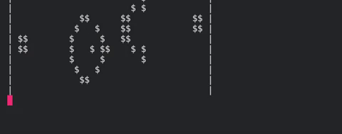

# Conway's Game of Life

### Rules
Each cell looks at its 8 immediate neighbors (of course edge cells look at those available)

There are 4 rules that change the status of each cell:

If the cell is alive:
1. 0 or 1 alive neighbors ➜ DEAD (underpopulation)
2. 2 or 3 alive neighbors ➜ ALIVE (optimal neighborhood)
3. More than 3 alive neighbors ➜ DEAD (overpopulation)
   
If the cell is dead:
4. Exactly 3 alive neighbors ➜ ALIVE (reproduction)
   

### Gosper Glider Gun - Game of Life Soup:

Done through [tutorial]()